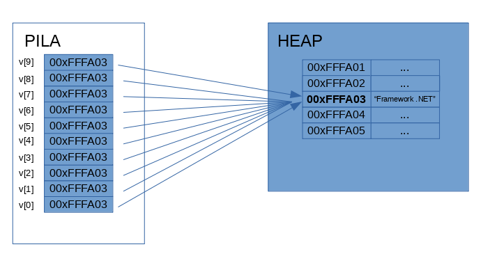
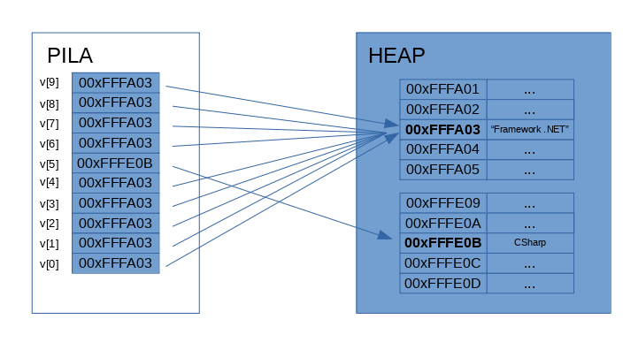

# Trabajo Práctico N°2

## Ejercicio 01

~~~
char c1 = 'A';
string st1 = "A";
object o1 = c1;        // => Boxing
object o2 = st1;
char c2 = (char)o1;        // => Unboxing
string st2 = (string)o2;
~~~

* __Boxing:__ Consiste en que el compilador se ve forzado a convertir un tipo por valor en un tipo por referencia, y por tanto a almacenarlo en la memoria HEAP en lugar de en la pila. Lo que tendríamos al final del proceso, es un nuevo objeto en la memoria HEAP que albergaría el valor original, y en la pila habría una referencia a este objeto.
* __Unboxing:__ A la operación contraria se le llama UnBoxing, y se produce cuando el tipo por referencia se convierte o se asigna a un tipo por valor de nuevo. El valor que estaba alojado en la memoria HEAP se guarad en la pila (mediante casteo).

En los ejemplos dados para el ejercicio, solo el proceso de guardar un tipo crácter dentro de un objeto es considerado ***boxing***, ya que un string es un tipo referencia y no genera la converción. De manera inversa, solo la asiganción del carácter, almacenado en un objeto, y pasado por medio de casteo a una variable caracter, es considerado ***unboxing***.

## Ejercicio 2
~~~
object o1 = "A";
object o2 = o1;
o2 = "Z";
Console.WriteLine(o1 + " " + o2);
~~~

La salida por consola es `A Z` y no `Z Z`, porque al ejecutarse la asignación de o2 (`02 = "Z"`), se considera una operación de ***boxing*** por tratarse de una asiganción de un literal a un objeto, lo que guarda el valor "Z" en la memoria HEAP y su referencia en la pila, pisando la referencia anteriormente guardada en esa variable.

## Ejercicio 3
~~~
int sum = 0;
int i = 1;
while (i <= 10);
{
sum += i++;
}
~~~

El programa funciona correctamente y el unico problema que se encuentra es el `;` extra que hay despues de la sentencia del `while`, quitando ese signo de mas, el programa funciona correctamente.

## Ejercicio 4

Cuando se ejecuta el método Main, el array de argumentos (args) se crea, pero al no pasar ningún parametro, el mismo queda vacío. Por lo que la consola arroja:
~~~
System.Console.WriteLine(args == null);    // => false
System.Console.WriteLine(args.Length);    // => 0
~~~

## Ejercicio 5

La sentencia `int[] vector = new int[0];`, crea una variable llamada *vector* la cual es un array de enteros, y la inicializa con un tamaño de 0, por lo que no tiene valores internos y la longitud del mismo es 0. La variable no es *null*.

## Ejercicio 6

La linea de codigo `Console.WriteLine("¡Hola {0}!", args[0]);` imprime en consola un texto generado en base al primer arguemento ingresado por consola. EN caso de que no se provea un argumento, la ejecución del programa se detendrá y arrojará una excepción de tipo *IndexOutOfRangeException*, indicando que se ha solicitado un elemento de un indice de un array que no esta definido.

## EJercicio 7

~~~
char c;
char? c2;
string st;
c = "";                        => No se puede convertir de manera implicita un string en un char (la cadena vacia se considera string)
c = '';                        => No se puede asignar un caracter literal vacío.                    
c = null;                    => Las variables tipo valor no pueden contener el valor null, a menos que se declare como un nullable   
c2 = null;
c2 = (65 as char?);               => No es un error, pero emite una advertencia, ya que un literal entero convertido a char siempre será null.
st = "";
st = '';                    => No se puede asignar un caracter literal vacío.
st = null;
st = (char)65;                => No se puede convertir un caracter a string
st = (string)65;            => NO se puede convertir, de manera implicita, un entero a un string
st = 47.89.ToString();
~~~

## Ejercicio 8

* ***a)***
~~~
for(int i = 0; i < args.Length; i++){
    Console.WriteLine("Hola {0}", args[i]);
}
~~~
* ***b)***
~~~
foreach (var item in args){}
    Console.WriteLine("Hola {0}", item);
}
~~~

## Ejercicio 9

La clase *StringBuilder* representa una cadena mutable de caracteres. A diferencia del tipo *String*, el cual es un tipo inmutable, es decir, que cada operación que parece modificar el objeto String en realidad crea una nueva cadena; un objeto *StringBuilder* permite mutar el contenido de la cadena original una vez que se ha creado una instancia de la clase, este se puede modificar agregando, quitando, reemplazando o insertando caracteres. 
Aunque la clase *StringBuilder* generalmente ofrece un mejor rendimiento que la clase *String* , no debe reemplazar automáticamente String con *StringBuilder* siempre que desee manipular cadenas. El rendimiento depende del tamaño de la cadena, la cantidad de memoria que se asignará a la nueva cadena, el sistema en el que se ejecuta la aplicación y el tipo de operación. Se debe estar preparado para probar la aplicación y determinar si *StringBuilder* realmente ofrece una mejora significativa en el rendimiento.

En que momento debo usar String:
* Cuando la cantidad de cambios que su aplicación realizará en una cadena es pequeña. 
* Cuando está realizando un número fijo de operaciones de concatenación, particularmente con cadenas literales.
* Cuando tiene que realizar operaciones de búsqueda extensas mientras está construyendo su cadena. La clase *StringBuilder* carece de métodos de búsqueda como **IndexOf** o **StartsWith**.

En que momento usar StringBuilder:
* Cuando espera que su aplicación realice un número desconocido de cambios en una cadena en el momento del diseño.
* Cuando espera que su aplicación realice una cantidad significativa de cambios en una cadena.

Aqui podemos ver un ejemplo de un código que concatena cadenas de texto a una cadena original unas 10000 veces:
~~~
Stopwatch timeString = new Stopwatch();
// Stopwatch timeStringBuilder = new Stopwatch();
timeString.Start();
// timeStringBuilder.Start();
string st = "Numeros: ";
// StringBuilder stb = new StringBuilder("Numeros: ");
for (int i = 0; i < 10000; i++)
{
    st += i.ToString();
    // stb.Append(i.ToString());
}
Console.WriteLine(st);
// Console.WriteLine(stb);
Console.WriteLine($"Tiempo String: {timeString.Elapsed.TotalMilliseconds} ms");
// Console.WriteLine($"Tiempo StringBuilder: {timeString.Elapsed.TotalMilliseconds} ms");
~~~

Tener en cuenta de comentar las lineas de una de las variables para probar la otra. En este caso, Tiempo String es casi 160 milisegundos y Tiempo StringBuilder es alrededor de 70 milisegundos.

En el siguiente caso, vemos lo contrario, aqui solo definimos la variable y la mostramos en consola:
~~~
// Stopwatch timeString = new Stopwatch();
Stopwatch timeStringBuilder = new Stopwatch();
// timeString.Start();
timeStringBuilder.Start();
// string st = "Hola mundo";
StringBuilder stb = new StringBuilder("Hola mundo"); 
// Console.WriteLine(st);
Console.WriteLine(stb);
// Console.WriteLine($"Tiempo String: {timeString.Elapsed.TotalMilliseconds} ms");
Console.WriteLine($"Tiempo StringBuilder: {timeStringBuilder.Elapsed.TotalMilliseconds} ms");
~~~

Ahora Tiempo String es de 0,0112 milisegundos y Tiempo StringBuilder es alrededor de 0,0833 milisegundos, es decir, casi 8 veces mayor.

## Ejercicio 10

EL tipo `DateTime` nos permite trabajar con tiempos estandarizados. Podemos definir valores pasados, futuros o recibir la información actual. Podemos utilizar distintos formatos predefinidos o definir el nuestro propio.
Para poder medir el tiempo de ejecución con `DateTime`, debemos establecer dos variables, una al inicio de la suseción de lineas, y una al final del código a testear; luego realizamos la resta de ambas y exponemos la diferencia. 
~~~
// Inicia el contador:
DateTime tiempo1 = DateTime.Now;
 
// Código del programa...
 
// Para el contador e imprime el resultado:
DateTime tiempo2 = DateTime.Now;
TimeSpan total = new TimeSpan(tiempo2.Ticks - tiempo1.Ticks);
Console.Write( "TIEMPO: " + total.ToString() );
~~~
Este método es bastante impreciso y no depende integramente del programador.
Para poder realizar una mejor medida, e puede utilizar la clase Stopwatch que proviene de *System.Diagnostics* y que fue diseñada para medir tiempos de proceso. La çlase nos entrega métodos para iniciar el reloj (.Start()) y para detenerlo (.Stop()). Luego podemos utilizar la información resultante. 
~~~
// Inicia el contador:
Stopwatch tiempo = Stopwatch.StartNew();
 
// Código del programa...
 
// Para el contador e imprime el resultado:
Console.Write( "TIEMPO: " + tiempo.Elapsed.Seconds.ToString() );
~~~  

## Ejercicio 11

El método *Split* divide una cadena en subcadenas según un carácter delimitador especificado. Retorna un array cuyos elementos contienen las subcadenas de esta instancia que estaban delimitadas por el carácter delimitador.
~~~
Console.WriteLine("Ingrese una frase: ");
string frase = Console.ReadLine();
string[] fraseDividida = frase.Split(" ");
foreach (var palabra in fraseDividida)
{
    Console.WriteLine(palabra);
}
~~~

## Ejercicio 12

* ***a)*** En el primer punto de observación, nos encontramos con que, por medio de un ciclo `foreach`, se le asigna a todos los objetos del array **v** el contenido del primer objeto, pero como es por referencia, entonces reciben la dirección de la variable *StringBuilder* que fue inicializado en el primer elemento del array. Por eso es que, al imprimir en panttalla el contenido del array, nos encontramos con que todos poseen lo mismo (la dirección del *StringBuilder*):

* ***b)*** EN el segundo caso, asignamos un nuevo objeto tipo *StringBuilder* al 6 elemento del array, generando un nuevo valor en la HEAP y almacenando la dirección del mismo en la pila, entonces al imprimir, obtendremos lo mismo que el caso anterior, solo diferenciado por que en la posición 6 veremos la leyenda *CSharp*:

## Ejercicio 13

* ***a)*** Se imprimen los meses en orden inverso. 
~~~
enum Meses
{
    Enero, Febrero, Marzo, Abril, Mayo, Junio, Julio, Agosto, Septiembre, Octubre, NoviembreDiciembre
}
static void Main(string[] args)
{
    string[] meses = Enum.GetNames(typeof(Meses));
    for (int i = 0; i < meses.Length; i++)
    {
        Meses mes = (Meses)Enum.Parse(typeof(Meses), meses[meses.Length-i-1]);
        Console.WriteLine("   {0} ({0:D})", mes);
    }
}
~~~

* ***b)*** Se pide un mes por consola y se evalua si esta en la lista. 
~~~
string[] meses = Enum.GetNames(typeof(Meses));
Console.WriteLine("Ingrese una palabra para compararala con la base de meses: ");
string mesIngresado = Console.ReadLine().ToLower();
bool encontro = false;
for (int i = 0; i < meses.Length; i++)
{
    Meses mes = (Meses)Enum.Parse(typeof(Meses), meses[i]);
    if(mes.ToString().ToLower().IndexOf(mesIngresado) != -1){
        Console.WriteLine("Mes encontrado: {0}", mes.ToString());
        encontro = true;
        break;
    }
}
if(!encontro){
    Console.WriteLine("Mes NO encontrado");
}
~~~

## Ejercicio 14

Este es el código de ejecución:
~~~
 int num = args.Length != 0 ? Int32.Parse(args[0]) : 0;
if (num != 0)
{
    for (int i = 1; i <= num; i++)
    {
        if (Program.esPrimo(i))
        {
            Console.WriteLine(i);
        }
    }
}
else
{
    Console.WriteLine("Debe ingresar un numero por consola para poder calcular si es primo");
}
~~~

Y aquí está la función que permite calcular los primos:

~~~
static bool esPrimo(int n)
{
    for (int i = 2; i <= Math.Sqrt(n); i++)
    {
        if (n % i == 0)
        {
            return false;
        }
    }
    return true;
}
~~~

## Ejercicio 15

Para realizar la formula, utilizamos la recursividad:
~~~
static int Fib(int n)
{
    if (n <= 2)
    {
        return 1;
    }
    else
    {
        return Fib(n - 1) + Fib(n - 2);
    }
}
~~~

## Ejercicio 16

Primero generamos un programa para recibir los argumentos y mostrar en pantalla el numero con su factorial:
~~~
int num = args.Length != 0 ? Int32.Parse(args[0]) : 0;
if (num != 0)
{
    Console.WriteLine("Factorial de {0}: {1}", num, Program.Fac(num));
}
else
{
    Console.WriteLine("Debe ingresar un numero por consola para poder calcular su factorial");
}
~~~

* ***a)*** Función no recursiva para calcular el factorial de un nuemro ingresado por parametro:
~~~
static int Fac(int n)
{
    int total = 1;
    for (int i = 1; i <= n; i++)
    {
        total *= i;
    }
    return total;
}
~~~ 

* ***b)*** Función recursiva para calcular el factorial de un nuemro ingresado por parametro:
~~~
static int Fac(int n)
{
    if (n == 1)
    {
        return 1;
    }
    else
    {
        return n * Fac(n-1);
    }
}
~~~ 

* ***c)*** Función recursiva con *expression-bodied members* para calcular el factorial de un numero ingresado por parametro:
~~~
static int Fac(int n) => n == 1 ? 1 : n * Fac(n-1);
~~~ 

## Ejercicio 17

Primero generamos un programa para recibir los argumentos y mostrar en pantalla el numero con su factorial usando un parametro de salida:
~~~
int num = args.Length != 0 ? Int32.Parse(args[0]) : 0;
if (num != 0)
{
    int result;
    Program.Fac(num, out result);
    Console.WriteLine("Factorial de {0}: {1}", num, result);
}
else
{
    Console.WriteLine("Debe ingresar un numero por consola para poder calcular su factorial");
}
~~~

* ***a)*** Función no recursiva para calcular el factorial de un nuemro ingresado por parametro:
~~~
static void Fac(int n, out int r)
{
    int total = 1;
    for (int i = 1; i <= n; i++)
    {
        total *= i;
    }
    r = total;
}
~~~ 

* ***b)*** Función recursiva para calcular el factorial de un nuemro ingresado por parametro:
~~~
static void Fac(int n, out int r)
{
    if (n == 1)
    {
        r = 1;
    }
    else
    {
        int r2;
        Fac(n - 1, out r2);
        r = n * r2;
    }
}
~~~ 

## Ejercicio 18

Primero generamos un programa para recibir los argumentos y mostrar en pantalla los numeros antes y despues del Swap:
~~~
 static void Main(string[] args)
    {
        int a = Int32.Parse(args[0]);
        int b = Int32.Parse(args[1]);
        Console.WriteLine("Normal {0} == {1}", a, b);
        Program.Swap(ref a, ref b);
        Console.WriteLine("Swap {0} == {1}", a, b);
    }
~~~

Luego generamos una función que realice le Swap.
~~~
static void Swap(ref int a, ref int b)
{
    int temp = a;
    a = b;
    b = temp;
}
~~~ 

## Ejercicio 19

Primero generamos un programa para imprimir lo que se pide mediante le método Imprimir():
~~~
static void Main(String[] args)
{
    Imprimir(1, "casa", 'A', 3.4, DayOfWeek.Saturday);
    Imprimir(1, 2, "tres");
    Imprimir();
    Imprimir("-------------");
}
~~~

Luego generamos el método que realice la impresión.
~~~
static void Imprimir(params object[] vector)
{
    foreach (object item in vector)
    {
        Console.Write(item + " ");
    }
    Console.WriteLine();
}
~~~ 

